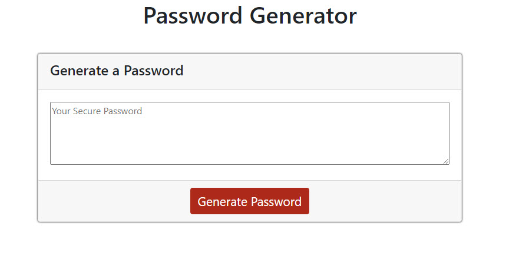

## Password Generator Homework

The project is to have a propper password generate using javascript. I will go through a series of prompt the user to select to help generate that random password. 

The password is to include:
    1. A length of 8 to 128 characters. 
    2. Lowercase Characters
    3. Uppercase Characters
    4. Numeric Characters
    5. Special Characters. 

Link to site. https://jaredseefried.github.io/homework3-password-generator/ 

